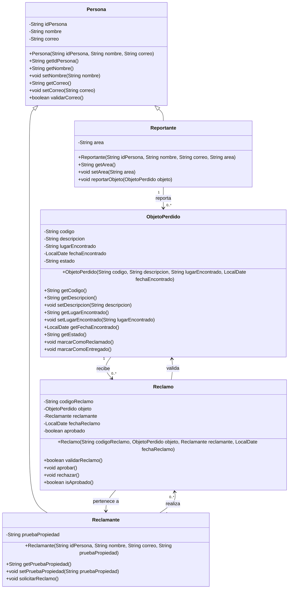
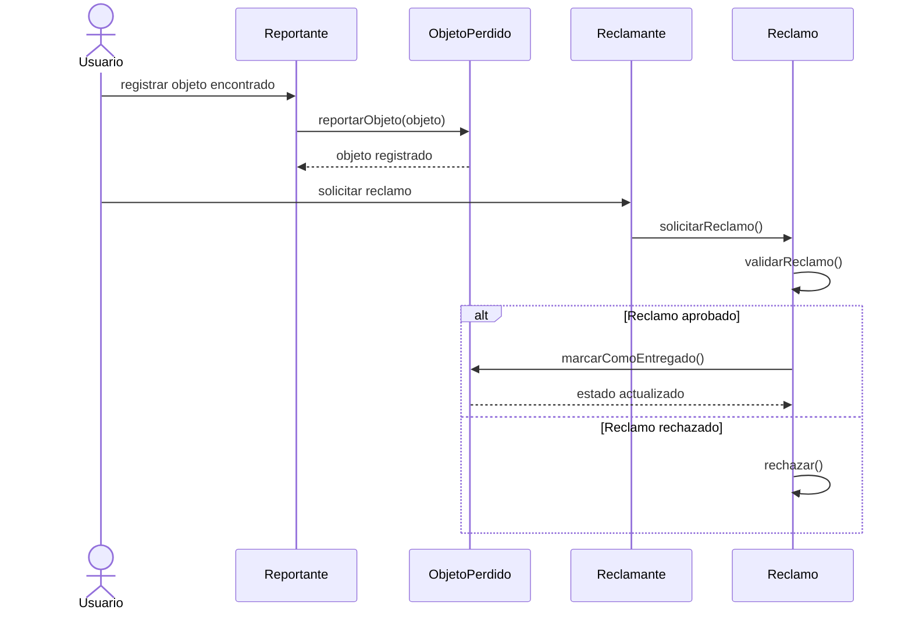

# Sistema de Custodia de Objetos Perdidos

## Descripción del contexto del problema

En una universidad es común que los estudiantes, docentes o personal administrativo pierdan objetos personales como memorias USB, cuadernos, llaves, cargadores, calculadoras o carnés. Cuando estos objetos son encontrados, normalmente son entregados a una oficina o área encargada de resguardarlos hasta que su dueño los reclame.

El sistema propuesto permite registrar objetos perdidos, identificar a la persona que los reportó, controlar los reclamos realizados por posibles dueños y determinar si un objeto puede ser entregado. De esta forma, se evita que los objetos sean entregados sin verificación o que su estado sea modificado de manera incorrecta.

## Necesidad de proteger los datos

En este contexto es importante proteger la información de las clases porque los datos representan objetos reales y procesos que deben ser controlados. Por ejemplo, un objeto no debería marcarse como entregado sin antes validar un reclamo. De igual forma, el código del objeto no debería modificarse libremente, ya que sirve como identificador único dentro del sistema.

Por esta razón, los atributos deben declararse como privados y modificarse únicamente mediante métodos controlados. Esto permite aplicar encapsulamiento, validaciones y reglas de negocio dentro de cada clase.

## Información que requiere control de acceso

La información que debe protegerse incluye:

- Código del objeto perdido.
- Estado del objeto.
- Datos de la persona que reporta el objeto.
- Datos del reclamante.
- Prueba de propiedad presentada por el reclamante.
- Estado de aprobación del reclamo.

El estado del objeto solo debe cambiar mediante métodos como `marcarComoReclamado()` o `marcarComoEntregado()`. De igual forma, un reclamo solo debe aprobarse si cumple con las condiciones necesarias.

## Diagrama de clases



## Modelo de comunicación entre objetos



## Explicación del modelo

El sistema inicia cuando un reportante registra un objeto encontrado dentro de la universidad. El objeto queda almacenado con un código único, una descripción, el lugar donde fue encontrado, la fecha y un estado inicial.

Cuando una persona considera que el objeto le pertenece, se registra como reclamante y presenta una prueba de propiedad. Luego se crea un reclamo asociado al objeto y al reclamante. El reclamo se valida y, si es aprobado, el objeto cambia su estado a entregado.

## Aplicación de Programación Orientada a Objetos

El proyecto aplica los siguientes principios:

- Encapsulamiento: los atributos son privados y se accede a ellos mediante métodos públicos.
- Herencia: las clases `Reportante` y `Reclamante` heredan de `Persona`.
- Asociación: las clases `ObjetoPerdido`, `Reclamante` y `Reclamo` interactúan entre sí.
- Validación: los métodos controlan cuándo se puede modificar el estado de un objeto o aprobar un reclamo.
- Responsabilidad de clases: cada clase representa una entidad clara del problema.

## Estructura sugerida del proyecto Java

```text
src/
└── org/
    └── ezone/
        └── objetosperdidos/
            ├── Main.java
            ├── model/
            │   ├── Persona.java
            │   ├── Reportante.java
            │   ├── Reclamante.java
            │   ├── ObjetoPerdido.java
            │   └── Reclamo.java
            └── service/
                └── GestionObjetosService.java
```

## Objetivo de la solución

Desarrollar un sistema orientado a objetos que permita registrar, reclamar y entregar objetos perdidos dentro de una universidad, asegurando que los datos importantes estén protegidos y que las modificaciones se realicen únicamente mediante métodos controlados.