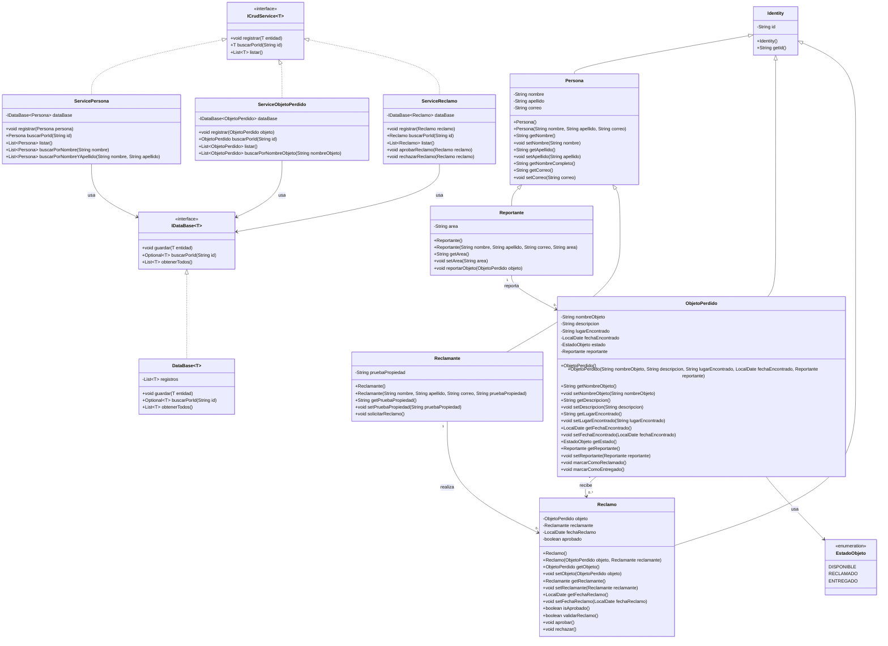

# Sistema de Custodia de Objetos Perdidos

## Descripción del contexto del problema

En una universidad es común que estudiantes, docentes o personal administrativo pierdan objetos personales como memorias USB, cuadernos, llaves, cargadores, calculadoras o carnés. Cuando estos objetos son encontrados, normalmente son entregados a un área encargada de resguardarlos hasta que su dueño pueda reclamarlos.

El sistema propuesto permite registrar personas que reportan objetos encontrados, registrar reclamantes, almacenar objetos perdidos y gestionar reclamos. La solución busca evitar entregas incorrectas mediante un control básico de estados y validaciones. De esta manera, un objeto no puede marcarse como entregado sin pasar por un reclamo, y la información ingresada se valida antes de almacenarse.

## Necesidad de proteger los datos

En este contexto es necesario proteger los datos porque representan objetos reales y procesos que deben mantenerse consistentes. Por ejemplo, el identificador interno de una persona, objeto o reclamo no debe modificarse manualmente, ya que sirve para reconocer cada instancia de manera única dentro del sistema.

También es importante controlar el estado de los objetos perdidos. Un objeto no debería pasar directamente a entregado desde cualquier parte del programa. Por eso, el cambio de estado se realiza mediante métodos como `marcarComoReclamado()` y `marcarComoEntregado()`, evitando modificaciones directas desde el menú o desde otras clases.

La solución aplica encapsulamiento mediante atributos privados, métodos públicos controlados, UUID para identidad interna y validaciones con Jakarta Validation e Hibernate Validator.

## Información que requiere control de acceso, validación o modificación controlada

La información que requiere control incluye:

- Identificador interno generado por UUID.
- Nombre, apellido y correo de las personas.
- Área del reportante.
- Prueba de propiedad del reclamante.
- Nombre, descripción, lugar y fecha del objeto perdido.
- Estado del objeto perdido.
- Aprobación del reclamo.
- Relación entre objeto perdido y reclamante.

El usuario no interactúa directamente con los UUID desde el menú. Estos identificadores se mantienen para lógica interna, búsqueda técnica y consistencia del sistema. En cambio, el menú trabaja con datos más naturales para el usuario, como nombres, apellidos y nombre del objeto.

## Tecnologías y recursos aplicados

El proyecto utiliza:

- Java.
- Maven.
- Jakarta Validation.
- Hibernate Validator.
- GlassFish Jakarta EL como dependencia de soporte para las validaciones.
- Programación Orientada a Objetos.
- UUID para identidad interna.
- Genéricos para una base de datos en memoria.
- Excepciones personalizadas.
- Anotaciones de validación personalizadas.
- Menú por consola organizado por módulos.
- Diagramas UML representados con Mermaid.

## Diagrama de clases



## Explicación del modelo

El sistema inicia desde un menú principal dividido en tres módulos: administración de personas, administración de objetos perdidos y administración de reclamos.

En el módulo de personas se pueden registrar reportantes y reclamantes. Ambos heredan de la clase abstracta `Persona`, pero cada uno tiene información propia. El reportante posee un área y el reclamante posee una prueba de propiedad.

En el módulo de objetos perdidos se registra un objeto encontrado. Para asociarlo con un reportante, el sistema solicita el nombre de la persona. Si encuentra varias coincidencias, muestra los nombres completos y permite seleccionar con más precisión. El UUID existe internamente, pero no se solicita al usuario.

En el módulo de reclamos se solicita el nombre del objeto. Si hay varios objetos con el mismo nombre, el sistema muestra sus datos para que el usuario seleccione cuál corresponde. Luego se busca al reclamante por nombre y se crea un reclamo asociado al objeto seleccionado.

Cuando un reclamo se aprueba, el sistema valida que el objeto esté disponible y que el reclamante tenga una prueba de propiedad válida. Si cumple las condiciones, el objeto cambia su estado mediante métodos controlados.

## Aplicación de Programación Orientada a Objetos

El proyecto aplica los siguientes principios y conceptos:

- Encapsulamiento: los atributos son privados y se accede a ellos mediante getters, setters y métodos controlados.
- Herencia: `Reportante` y `Reclamante` heredan de `Persona`; además, las entidades principales heredan de `Identity`.
- Abstracción: `Persona` e `Identity` representan elementos generales reutilizables.
- Asociación: `ObjetoPerdido` se asocia con `Reportante`, y `Reclamo` se asocia con `ObjetoPerdido` y `Reclamante`.
- Genéricos: `DataBase<T>` e interfaces como `IDataBase<T>` e `ICrudService<T>` permiten reutilizar lógica.
- Validación: se utilizan anotaciones de Jakarta Validation y una anotación personalizada `@TextoLimpio`.
- Excepciones personalizadas: se controlan errores como entidades no encontradas, reclamos inválidos y objetos no disponibles.
- Responsabilidad única: las clases modelo representan datos y comportamiento propio, los servicios gestionan operaciones, la base de datos almacena en memoria y el menú controla la interacción con el usuario.

## Validaciones implementadas

El sistema utiliza validaciones como:

- `@NotBlank` para evitar campos vacíos.
- `@Size` para controlar longitudes mínimas y máximas.
- `@Email` para validar el formato del correo.
- `@NotNull` para evitar relaciones nulas.
- `@TextoLimpio` como anotación personalizada para permitir únicamente letras y espacios.

La validación se realiza en dos momentos:

1. Al ingresar datos desde el menú, para avisar el error inmediatamente y volver a pedir el campo.
2. Antes de guardar una entidad en el servicio, para asegurar que no se almacenen objetos inválidos.

## Estructura del proyecto Java

```text
src/main/java/org/Ezone/POO/
├── Main.java
├── annotation/
│   └── TextoLimpio.java
├── database/
│   ├── DataBase.java
│   └── IDataBase.java
├── exception/
│   ├── EntidadNoEncontradaException.java
│   ├── ObjetoNoDisponibleException.java
│   └── ReclamoInvalidoException.java
├── model/
│   ├── EstadoObjeto.java
│   ├── Identity.java
│   ├── ObjetoPerdido.java
│   ├── Persona.java
│   ├── Reclamante.java
│   ├── Reclamo.java
│   └── Reportante.java
├── service/
│   ├── ICrudService.java
│   ├── ServiceObjetoPerdido.java
│   ├── ServicePersona.java
│   └── ServiceReclamo.java
├── ui/
│   └── Menu.java
└── validator/
    ├── ValidadorJakarta.java
    └── ValidarTextoLimpio.java
```

## Dependencias Maven

```xml
<dependencies>
    <dependency>
        <groupId>org.hibernate.validator</groupId>
        <artifactId>hibernate-validator</artifactId>
        <version>8.0.3.Final</version>
    </dependency>

    <dependency>
        <groupId>jakarta.validation</groupId>
        <artifactId>jakarta.validation-api</artifactId>
        <version>3.0.2</version>
    </dependency>

    <dependency>
        <groupId>org.glassfish</groupId>
        <artifactId>jakarta.el</artifactId>
        <version>4.0.2</version>
    </dependency>
</dependencies>
```

## Funcionamiento general del menú

El menú principal se divide en:

```text
Sistema de custodia de objetos perdidos

1. Administrar personas
2. Administrar objetos perdidos
3. Administrar reclamos
0. Salir
```

El módulo de personas permite:

```text
1. Registrar reportante
2. Registrar reclamante
3. Listar personas
0. Volver
```

El módulo de objetos perdidos permite:

```text
1. Registrar objeto perdido
2. Listar objetos perdidos
0. Volver
```

El módulo de reclamos permite:

```text
1. Registrar reclamo
2. Aprobar reclamo
3. Rechazar reclamo
4. Listar reclamos
0. Volver
```

## Decisiones de diseño

El sistema mantiene UUID en las entidades mediante la clase `Identity`, pero no expone estos identificadores al usuario desde el menú. Esta decisión permite conservar una identidad interna única sin hacer que el usuario tenga que copiar o recordar códigos largos.

Las búsquedas visibles se realizan por nombre, apellido o nombre del objeto. Cuando existen varias coincidencias, el sistema muestra opciones para que el usuario seleccione la correcta.

También se decidió separar el menú en submenús para evitar una interfaz inicial demasiado extensa. Esto permite que el programa sea más claro y que cada módulo agrupe acciones relacionadas.

## Objetivo de la solución

Desarrollar un sistema orientado a objetos que permita registrar, reclamar y entregar objetos perdidos dentro de una universidad, asegurando que los datos importantes estén protegidos, validados y modificados únicamente mediante métodos controlados.